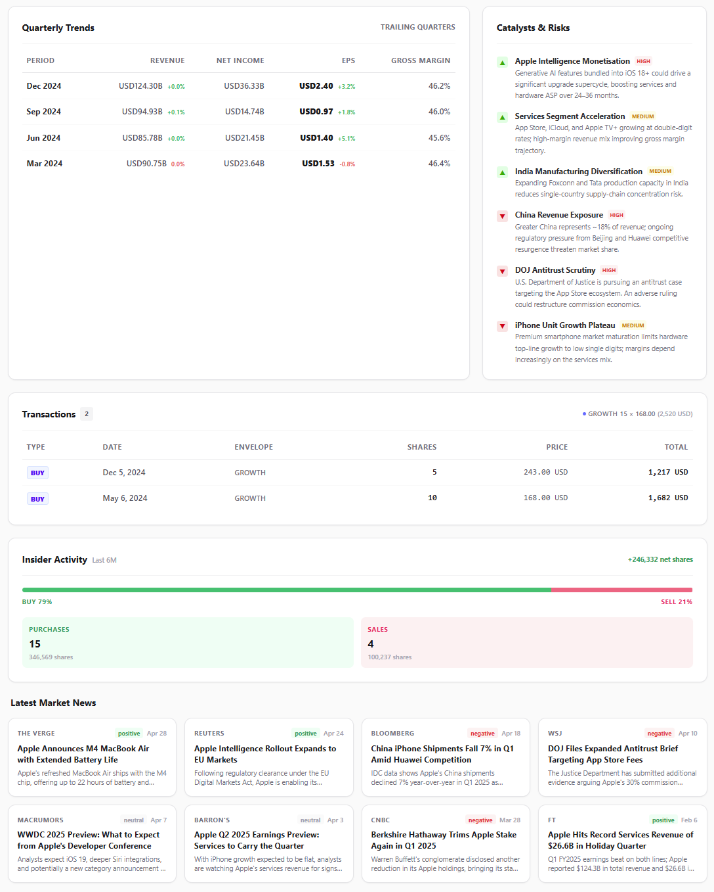

<p align="center"></p>
<h2 align="center">Stonks</h2>

<div align="center">

[](https://ko-fi.com/itskovacs)

[](https://github.com/itskovacs/stonks/issues)

</div>

<div align="center">


*Dashboard with mocked data, available in [demo](https://itskovacs-stonks.netlify.app/)*

</div>


## Stonks?

Stonks is a minimalist personal portfolio tracker built around one idea: **less is more**.

No broker integrations, no algorithmic trading. You add your trades and get clean data back for your portfolio: current prices, unrealized gains, allocation breakdowns, and a basic stock analysis page for any ticker you want to research.

It does one thing and does it well: it tells you where your money is and how it's doing, with just enough market data (and pseudo-computed scores) to make informed decisions without overwhelming you.

No telemetry. No tracking. No ads. Free, forever.

> [!IMPORTANT]
> **Keep in mind that this app is strictly for education, not financial advice. Investing involves risk, so always do your own research and invest responsibly!**

## 🌱 Getting Started <a name = "getting_started"></a>

Deployment is designed to be simple using Docker.

### Option 1: Docker Compose (Recommended)

Use the `docker-compose.yml` file provided in this repository. No changes are required, though you may customize it to suit your needs.

Run the container:

```bash
docker-compose up -d
```

### Option 2: Docker Run

```bash
# Ensure you have the latest image
docker pull ghcr.io/itskovacs/stonks:1

# Run the container
docker run -d -p 8080:8000 -v ./storage:/app/storage ghcr.io/itskovacs/stonks:1
```


## 📸 Demo <a name = "demo"></a>

A demo is available at [itskovacs-stonks.netlify.app](https://itskovacs-stonks.netlify.app/).

<div align="center">

|         |         |
|:-------:|:-------:|
|  |  |
|  |  |

</div>

<br>

<div align="center">

Made with ❤️ in BZH  

<a href='https://ko-fi.com/itskovacs' target='_blank'></a>  
</div>


## Data Sources

All market data is sourced from Yahoo Finance (using **yfinance** library) and free public RSS feeds. No paid API keys are required.

Prices and fundamental data are TTL-cached in a local SQLite store to avoid redundant fetches:

| Data type                            | Cache TTL |
| ------------------------------------ | --------- |
| Quote info (price, ratios, metadata) | 1 hour    |
| Intraday / 5-day history             | 1 hour    |
| Daily history (includes today)       | 4 hours   |
| Historical range (past end date)     | 90 days   |
| Earnings calendar, analyst targets   | 24 hours  |
| Insider purchases, sector weightings | 24 hours  |
| Financials, dividends, splits        | 90 days   |

---

## API Reference

All endpoints are prefixed with `/api`. Every route except `/auth/login` and `/auth/register` requires authentication.

```
Authorization: Bearer <access_token>
```

Tokens are JWT. By default, access tokens expire in 30 minutes; refresh tokens in 24 hours.

---

### Authentication

| Method | Endpoint         | Body                     | Returns                           |
| ------ | ---------------- | ------------------------ | --------------------------------- |
| POST   | `/auth/login`    | `{ username, password }` | `{ access_token, refresh_token }` |
| POST   | `/auth/register` | `{ username, password }` | `{ access_token, refresh_token }` |
| POST   | `/auth/refresh`  | `{ refresh_token }`      | `{ access_token, refresh_token }` |

**Constraints:** username 1–19 chars `[a-zA-Z0-9_-]`.  
`/auth/refresh` rejects access tokens — the `typ` claim must be `"refresh"`.

---

### Dashboard

| Method | Endpoint                     | Query params                                      | Returns                                                                                                                                         |
| ------ | ---------------------------- | ------------------------------------------------- | ----------------------------------------------------------------------------------------------------------------------------------------------- |
| GET    | `/profile/dashboard`         | —                                                 | Watchlist rows, all positions with live P&L, envelope summaries, full transaction history, and aggregate totals                                 |
| GET    | `/profile/envelope/overview` | `period` — `1w / 1mo / 3mo / 6mo / ytd / 1y / 3y` | Daily mark-to-market equity chart per envelope, event timeline, and period stats (volatility, best/worst day, trade count, deposits, dividends) |

**Dashboard totals** include: total portfolio value, total cash, total cost basis, unrealized P&L, 1-day change, and rolling 90-day net deposits and dividend income.

---

### Watchlist

| Method | Endpoint                      | Params / Body                           | Returns                                                               |
| ------ | ----------------------------- | --------------------------------------- | --------------------------------------------------------------------- |
| GET    | `/profile/watchlist/trending` | —                                       | Up to 8 trending US tickers with live price and 7-day history         |
| GET    | `/profile/watchlist/search`   | `q` (string), `limit` (1–20, default 8) | Tickers matching the query, enriched with live price and daily change |
| POST   | `/profile/watchlist/add`      | `{ ticker }`                            | `{ status, ticker }` — snapshot of the added ticker                   |
| POST   | `/profile/watchlist/remove`   | `{ ticker }`                            | `{ status, watchlist }` — updated list of ticker symbols              |

---

### Envelopes

| Method | Endpoint                  | Body               | Returns                                          |
| ------ | ------------------------- | ------------------ | ------------------------------------------------ |
| POST   | `/profile/envelopes/add`  | `{ name, color? }` | `{ status, message }`                            |
| PUT    | `/profile/envelopes/{id}` | `{ name, color? }` | `{ status, message }` — rename or recolor        |
| DELETE | `/profile/envelopes/{id}` | —                  | `{ status, message }` — cascades to transactions |

---

### Transactions

| Method | Endpoint                     | Body                                                                    | Returns                                                                |
| ------ | ---------------------------- | ----------------------------------------------------------------------- | ---------------------------------------------------------------------- |
| POST   | `/profile/transactions`      | `{ type, price, envelope_name, ticker?, shares?, fees?, date?, note? }` | `{ status, message, transaction }` — the created transaction object    |
| DELETE | `/profile/transactions/{id}` | —                                                                       | `{}` — also reverses the cash effect on the envelope's running balance |

**Transaction types and total computation:**

| Type       | Cash effect | `total` formula                                   |
| ---------- | ----------- | ------------------------------------------------- |
| `DEPOSIT`  | `+total`    | `abs(price)`                                      |
| `WITHDRAW` | `−total`    | `abs(price)`                                      |
| `DIVIDEND` | `+total`    | `shares × price` if shares > 0, else `abs(price)` |
| `BUY`      | `−total`    | `(shares × price) + fees`                         |
| `SELL`     | `+total`    | `(shares × price) − fees`                         |

---

### Stock Research

| Method | Endpoint                 | Params                                              | Returns                                                                |
| ------ | ------------------------ | --------------------------------------------------- | ---------------------------------------------------------------------- |
| GET    | `/stock/report/{ticker}` | path: ticker symbol                                 | Full research report (see below)                                       |
| GET    | `/stock/chart/{ticker}`  | `period` — `1d / 1w / 1m / 3m / 6m / ytd / 1y / 5y` | OHLCV price chart with annotations (dividends, splits, earnings dates) |

**Stock report payload fields:**

| Field               | Description                                                                                   |
| ------------------- | --------------------------------------------------------------------------------------------- |
| `stock_bar`         | Current price, 1-day change, YTD return, 52-week high/low, beta, RSI, SMA 50/200, volume      |
| `risk_gauge`        | Composite 0–100 risk score with per-component breakdown and label                             |
| `kpi_strip`         | Key financial ratios formatted for display (P/E, EV/EBITDA, ROE, etc.)                        |
| `valuation_grid`    | Valuation metrics with green/amber/red status and a 0–100 sub-score                           |
| `health_grid`       | Balance sheet and return metrics with status and sub-score                                    |
| `growth_grid`       | Revenue, earnings, and margin trend metrics with status and sub-score                         |
| `score_breakdown`   | Weighted composite factor score (valuation 35%, health 35%, growth 30%) with letter grade     |
| `quarterly_trend`   | Up to 4 trailing quarters: revenue, net income, EPS, EPS surprise %, gross margin             |
| `earnings_update`   | Last and next earnings dates, EPS and revenue actuals vs estimates, analyst count             |
| `catalysts_risks`   | Identified catalyst and risk factors with severity labels                                     |
| `rating_verdict`    | Analyst consensus rating, price target, upside %, signal bars, and confidence level           |
| `signals`           | Six technical indicator signals (BUY/HOLD/SELL) with raw values and aggregate summary         |
| `insider_activity`  | 6-month buy/sell transaction counts and share totals from SEC insider filings via yfinance    |
| `sector_weightings` | Sector allocation map for ETFs (empty object for equities)                                    |
| `news`              | Up to 10 recent headlines from Yahoo Finance, Google News, and Seeking Alpha with sentiment   |
| `user_positions`    | The authenticated user's transactions for this ticker (BUY, SELL, DIVIDEND)                   |
| `wac_by_envelope`   | Weighted average cost recap per envelope: current shares held, avg cost, and total cost basis |
| `in_watchlist`      | Whether the ticker is in the current user's watchlist                                         |

---

### News

| Method | Endpoint         | Query params               | Returns                                                                          |
| ------ | ---------------- | -------------------------- | -------------------------------------------------------------------------------- |
| GET    | `/news/{ticker}` | `limit` (1–50, default 20) | Headlines from Yahoo Finance, Google News, and Seeking Alpha with sentiment tags |

Sentiment is rule-based (positive / negative / neutral) using a curated lexicon applied to the headline text. Results are deduplicated and sorted by publication date.