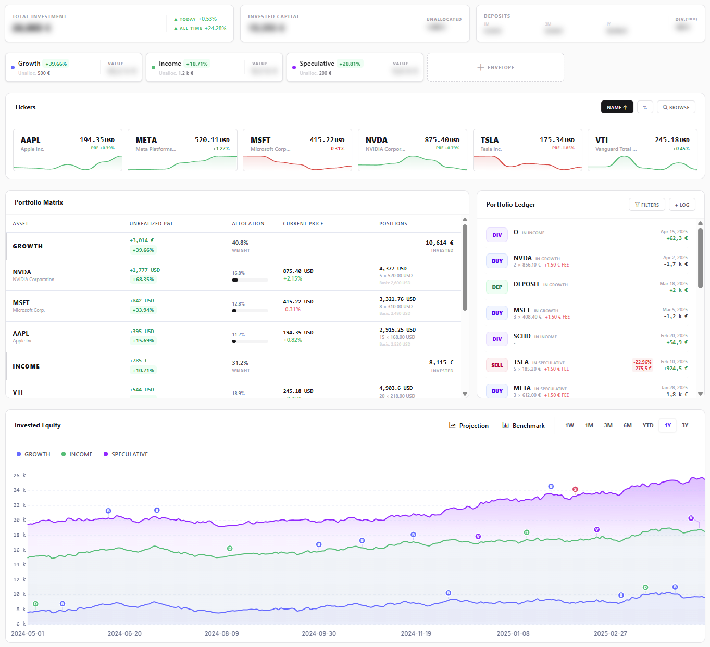
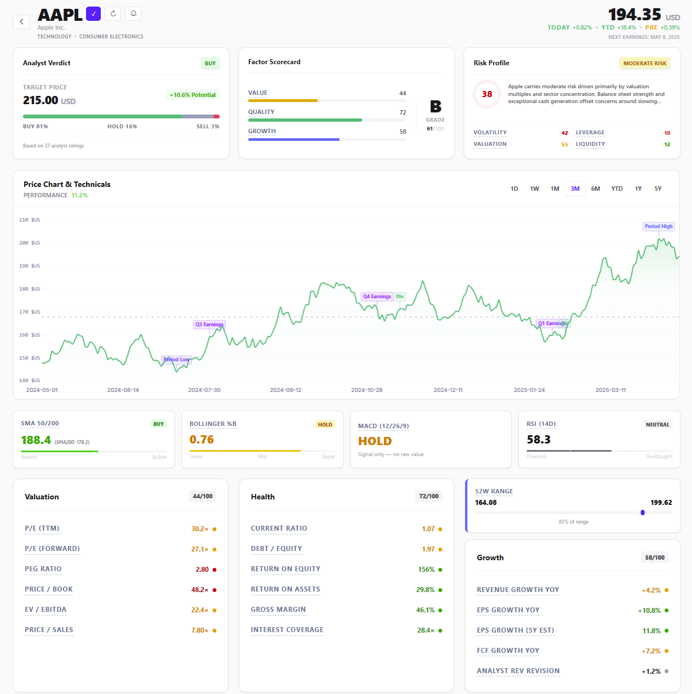
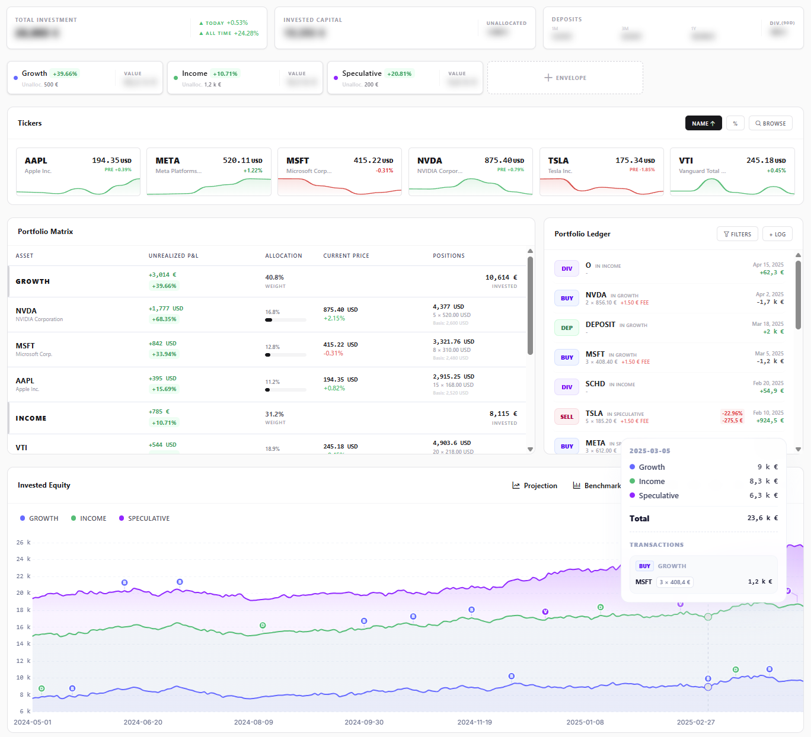
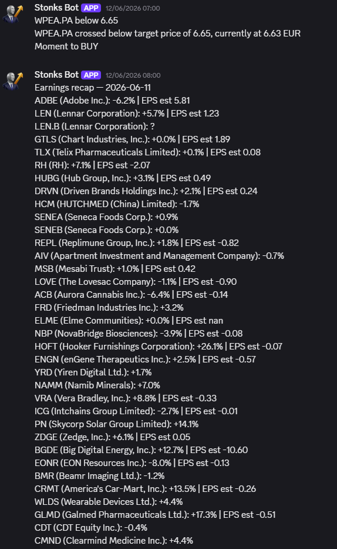

<p align="center"></p>
<h2 align="center">Stonks</h2>

<div align="center">

[](https://ko-fi.com/itskovacs)

[](https://github.com/itskovacs/stonks/issues)

</div>

<div align="center">


*Demo Dashboard with mocked data, available in [demo](https://itskovacs-stonks.netlify.app/)*

</div>


## Introduction

Stonks is a minimalist personal portfolio tracker.

It focuses on one thing: it tells you where your money is and how it's doing, with just enough market data (and pseudo-computed scores) to make informed decisions without overwhelming you. No broker integrations, no algorithmic trading.

1. **Create an _Envelope_** (*Investment*, *Broker X*, *CTO*, etc.)
2. **Log Transactions** (*BUY*, *SELL*, *DEPOSIT*, *WITHDRAW*, *DIVIDEND*). *Tip: use batch mode for faster entry.*
3. **View Portfolio Insights**: Get clear data on your allocation, current prices, unrealized PnL, and equity charts over time.

You can also browse and add any ticker you want to follow. Notifications included.

No telemetry. No tracking. No ads. Data from Yahoo Finance.

> [!TIP]
> To quickly setup your baseline, you can use these hacky steps:
> 1. Add all your current positions basis using `BUY`, do not forget fee if any
> 2. Check the *invested capital* in Stonks. Note it.
> 3. Check the cash available in your account. Note it.
> 4. Add a `DEPOSIT` with your *invested capital* + *cash available*.
> 
> Example:
> You have 4 positions, in _AAPL_, _TSLA_, _MSFT_, _NVDA_. Your account cash is 17.31$.  
> Add your positions using `BUY`.  
> * `BUY` `AAPL`: 12 × 280.91$  
> * `BUY` `TSLA`: 10 × 389.14$  
> * `BUY` `MSFT`: 10 × 420.49$  
> * `BUY` `NVDA`: 10 × 210.28$
> 
> The total is: _13570.02$_  
> Add a `DEPOSIT` of _13587.33$_ (positions: 13570.02$ + cash: 17.31$)


> [!IMPORTANT]
> **Investing involves risk, always do your own research and invest responsibly! Use at your own risk.**

## 🌱 Getting Started <a name = "getting_started"></a>

Deployment is designed to be simple using Docker.

### Option 1: Docker Compose (Recommended)

Use the `docker-compose.yml` file provided in this repository. No changes are required, though you may customize it to suit your needs.

Run the container:

```bash
docker-compose up -d
```

### Option 2: Docker Run

```bash
# Ensure you have the latest image
docker pull ghcr.io/itskovacs/stonks:1

# Run the container
docker run -d -p 8080:8000 -v ./storage:/app/storage ghcr.io/itskovacs/stonks:1
```

> [!NOTE]
> Config can be modified in `storage/config.env` (`SECRET_KEY`, `REGISTER_ENABLE`, `ACCESS_TOKEN_EXPIRE_MINUTES`, `REFRESH_TOKEN_EXPIRE_MINUTES`)

## 📸 Demo <a name = "demo"></a>

A demo is available at [itskovacs-stonks.netlify.app](https://itskovacs-stonks.netlify.app/).

<div align="center">

|         |         |
|:-------:|:-------:|
|  |  |
|  |  |

</div>

<br>

<div align="center">

Made with ❤️ in BZH  

<a href='https://ko-fi.com/itskovacs' target='_blank'></a>  
</div>